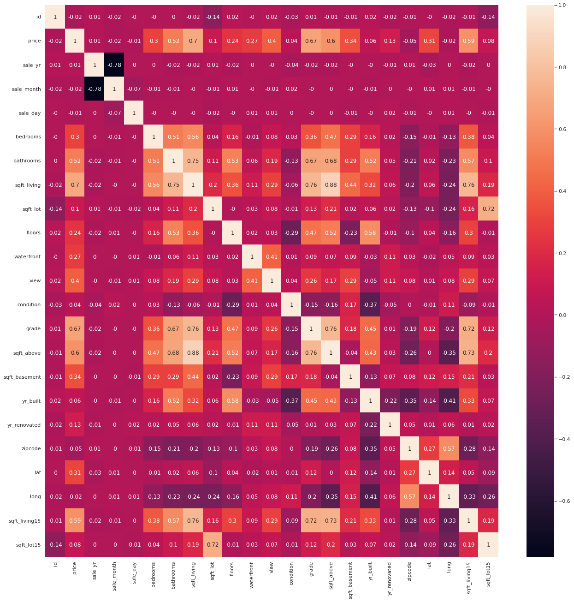
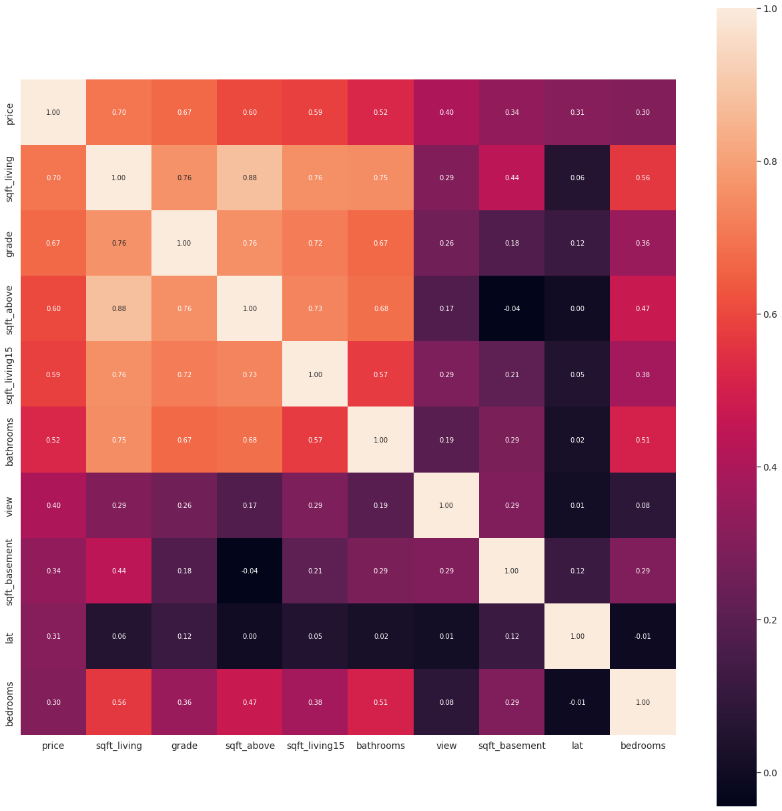
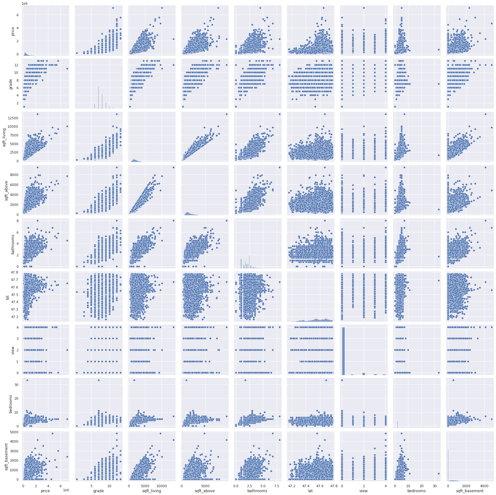
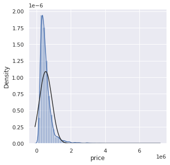
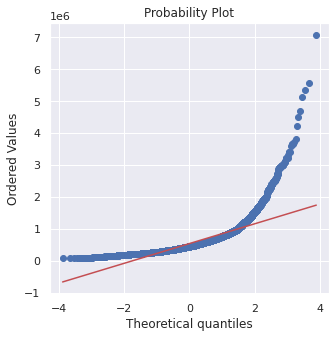
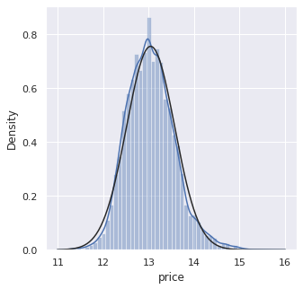
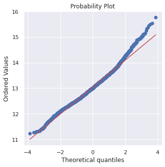

# House_Price_Prediction_Analysis in 3 Models
###### The Python code is transform form ipynb in Colab!

- [x] relu model
- [x] sklearn model
- [x] CNN model

## Step 1. Analyze the data in ```House_price_simple_RELU.py```
* 1. Look the all correlation in ```correlation_matrix```
* 2. Look the high correlation with price in ```scatter```
* 3. Adjust data distribution

### 1. Look the all correlation in ```correlation_matrix```

```
correlation_matrix = train.corr().round(2)
sns.set(rc={'figure.figsize':(22,22)})
# annot = True 讓我們可以把數字標進每個格子裡
sns.heatmap(data = correlation_matrix, annot = True)
```
This is to see the correlation in our data, then we can objective to inference about the relationship with every data.


### 2. Look the high correlation with price in ```scatter```

```
k = 10 #number ofvariables for heatmap
cols = corrmat.nlargest(k, 'price')['price'].index
cm = np.corrcoef(train[cols].values.T)
sns.set(font_scale=1.25)
hm = sns.heatmap(cm, cbar=True, annot=True, square=True, fmt='.2f', annot_kws={'size': 10}, 
yticklabels=cols.values, xticklabels=cols.values)
plt.show()
```
This is to see the high correlation with price, pick up 10 data out of this data.


And sactter this 10 data with 
```
sns.set()
cols = ['price', 'grade', 'sqft_living','sqft_above', 'bathrooms', 'lat', 'view', 'bedrooms', 'sqft_basement']
sns.pairplot(train[cols], size = 2.5)
plt.show();
```
View the linear relationship in the plot points.


You already know some of the main features, and this specific scatter plot gives us a reasoning idea about the relationship between variables.<br>
One, sqft_living sqft_above The picture between sqft_above is very deep.<br>
Price and other intermediate scatter plots are also worth thinking about.<br>

### 3. Adjust data distribution
###### Test the function is important in the inference.

First, look the data plot and draw the picture.
```
from scipy.stats import norm
from scipy import stats
sns.distplot(train['price'], fit = norm);
fig = plt.figure()
res = stats.probplot(train['price'], plot=plt)
```
 


It can be seen that the housing price distribution is not normal, showing the peak value and positive skewness, 
but it does not follow the diagonal.We can use logarithmic transformation ```train['price']= np.log(train['price'])``` to solve this problem.
 


Second, try fix every data and look the ```skewness``` in the data.
```
skewness = round(all.skew(), 2);print(f"偏度(Skewness):\n{skewness}")
sns.set(rc={'figure.figsize':(5,5)});sns.distplot(all[var], fit=norm); fig = plt.figure();res = stats.probplot(all[var], plot=plt)
```
```
Skewness:
id                0.61
price             3.79
bedrooms          1.97
bathrooms         0.51
sqft_living       1.47
sqft_lot         13.06
floors            0.73
waterfront       11.39
view              3.40
condition         1.03
grade             0.77
sqft_above        1.45
sqft_basement     1.58
yr_built         -0.47
yr_renovated      4.55
zipcode           0.41
lat              -0.49
long              0.46
sqft_living15     1.11
sqft_lot15        9.51
dtype: float64
```
We want the ```abs(Skewness)``` lower than 0.5, so try to fix it to linear..<br>
```
Skewness:
id                0.24
price             3.80
bedrooms         -0.45
bathrooms        -0.28
sqft_living      -0.02
sqft_lot          0.38
floors            0.49
waterfront       10.96
view              3.42
condition         0.06
grade             0.18
sqft_above        0.26
sqft_basement     0.47
yr_built          0.15
yr_renovated      4.59
zipcode           0.37
lat              -0.50
long              0.19
sqft_living15     0.19
sqft_lot15        0.55
dtype: float64
```
Third, analyze the outliers.
```
# 刪除離群值
print ("Shape Of The Before Ouliers: ",train[var].shape)
n=1.5
#IQR = Q3-Q1
IQR = np.percentile(train[var],75) - np.percentile(train[var],25)
# outlier = Q3 + n*IQR 
train=train[train[var] < np.percentile(train[var],75)+n*IQR]
# outlier = Q1 - n*IQR 
train=train[train[var] > np.percentile(train[var],25)-n*IQR]
print ("Shape Of The After Ouliers: ",train.shape)
```
Take out the data of outliers and test the prediction can better or not.

Forth, adjust the data.

Cause I want to do the log to all data, I take absolute value to the ```long``` value.<br>
